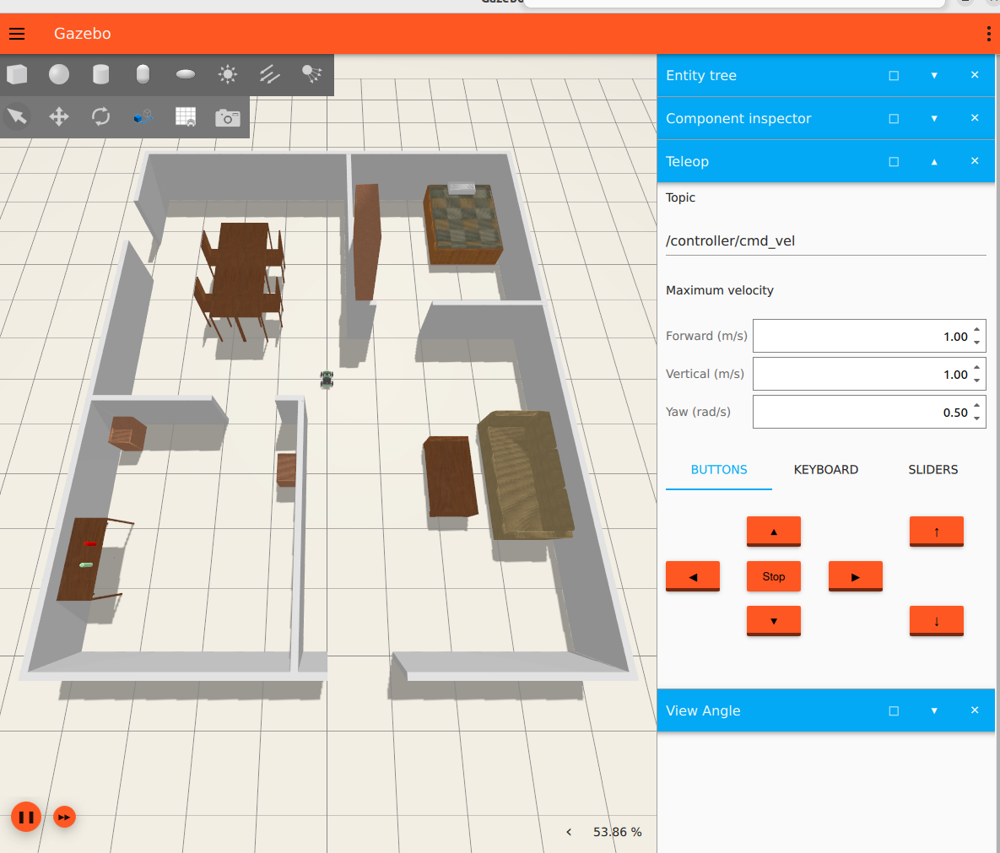
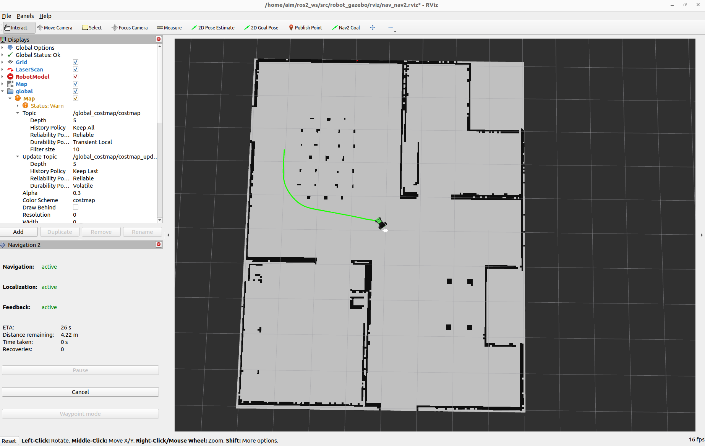

# 🚙 JetAcker Ackermann Navigation & Text-to-Place

> **ROS2 Humble 기반 Ackermann 자율주행 및 사용자 명령 기반 Navigation 시스템**

Gazebo 실내환경에서 LiDAR, Odometry, Nav2를 연동하고, 좌표·장소명·자연어 명령으로 로봇이 목적지까지 이동하도록 구현했습니다.

---

# 🎬 Project Overview

기존 JetAcker 시뮬레이션 모델을 실제 차량형 조향이 가능한 **Ackermann Steering** 구조로 재구성하고, ROS2 Nav2 기반 자율주행 시스템을 구축했습니다.

최종적으로 다음 기능을 구현했습니다.

- Ackermann 차량 모델 재구성
- 전륜 조향 및 후륜 구동 제어
- `/cmd_vel` 기반 Ackermann 운동학 변환
- Gazebo 실내환경 및 가구 모델 연동
- LiDAR, Odometry, TF 구성
- Nav2 기반 경로 계획 및 장애물 회피
- RViz Goal 기반 자율주행
- 좌표 입력 기반 이동
- 장소명 기반 이동
- 한국어 Text-to-Place Navigation

---

# 🧠 System Architecture

```text
┌──────────────────────────────────────────────────────┐
│                 User Command Layer                   │
│  RViz Goal / Coordinate / Place / Korean Text Input  │
└──────────────────────────┬───────────────────────────┘
                           │
                ┌──────────▼──────────┐
                │   NavigateToPose    │
                │    Action Client    │
                └──────────┬──────────┘
                           │
┌──────────────────────────▼───────────────────────────┐
│                       Nav2                           │
│                                                     │
│  AMCL                     → Current Pose Estimation │
│  Smac Hybrid-A*           → Global Path Planning    │
│  Global / Local Costmap   → Obstacle Representation │
│  Regulated Pure Pursuit   → Path Tracking           │
│  Behavior Tree            → Navigation Management   │
└──────────────────────────┬───────────────────────────┘
                           │
                      /cmd_vel
                           │
                ┌──────────▼──────────┐
                │ Ackermann Controller│
                │  Kinematic Convert  │
                └───────┬────────┬────┘
                        │        │
          ┌─────────────▼──┐  ┌──▼──────────────────┐
          │ Steering       │  │ Rear Wheel Velocity │
          │ Position Cmd   │  │ Command             │
          └─────────────┬──┘  └──┬──────────────────┘
                        │        │
                ┌───────▼────────▼───────┐
                │   ros2_control         │
                │   gz_ros2_control      │
                └──────────┬─────────────┘
                           │
                ┌──────────▼──────────┐
                │ Gazebo Ackermann Car│
                └─────────────────────┘
```

---

# 🏁 Development Sequence

| # | Development Task | Method |
|---|------------------|--------|
| 1 | 기존 JetAcker 모델 분석 | URDF/Xacro 및 Gazebo 패키지 구조 분석 |
| 2 | Ackermann 차량 모델 재구성 | Steering Joint + Wheel Joint 추가 |
| 3 | 차량 제어 시스템 구축 | ros2_control + Position/Velocity Controller |
| 4 | Ackermann 운동학 구현 | `/cmd_vel` → 조향각 + 후륜 속도 변환 |
| 5 | 센서 및 환경 연동 | LiDAR, Odometry, TF, Gazebo Furniture |
| 6 | Nav2 자율주행 구축 | AMCL + Smac Hybrid-A* + RPP |
| 7 | 장애물 회피 구현 | Costmap + Obstacle/Inflation Layer |
| 8 | 사용자 명령 Navigation | Coordinate / Place / Text-to-Place |

---

# 🔧 Key Technical Features

## 🚘 Ackermann Vehicle Model

기존 제조사 모델은 바퀴가 `fixed joint` 중심으로 구성되어 있어 실제 차량형 조향을 구현하기 어려웠습니다.

이를 다음 구조로 재구성했습니다.

```text
Front Wheel
base_link
   ↓
steering_joint
   ↓
steering_link
   ↓
wheel_joint
   ↓
front_wheel

Rear Wheel
base_link
   ↓
rear_wheel_joint
   ↓
rear_wheel
```

적용한 주요 Joint

```text
front_left_steering_joint
front_right_steering_joint
front_left_wheel_joint
front_right_wheel_joint
rear_left_wheel_joint
rear_right_wheel_joint
```

---

## ⚙️ ros2_control Vehicle Control

전륜은 Position Controller, 후륜은 Velocity Controller로 구성했습니다.

```text
Steering Position Controller
- front_left_steering_joint
- front_right_steering_joint

Rear Wheel Velocity Controller
- rear_left_wheel_joint
- rear_right_wheel_joint
```

사용 토픽

```text
/steering_position_controller/commands
/rear_wheel_velocity_controller/commands
```

---

## 📐 Ackermann Kinematics

Nav2에서 생성된 속도 명령을 실제 Ackermann 차량 제어값으로 변환했습니다.

```text
Input
linear.x
angular.z

Output
Left / Right Steering Angle
Left / Right Rear Wheel Velocity
```

기본 계산 구조

```text
Turning Radius
R = v / ω

Front Steering
δ_left  = atan(L / (R - W/2))
δ_right = atan(L / (R + W/2))

Rear Wheel Velocity
v_left  = ω(R - W/2)
v_right = ω(R + W/2)
```

검증 결과

```text
Left Steering Angle  > Right Steering Angle
Left Rear Velocity   < Right Rear Velocity
```

좌회전 시 안쪽 바퀴와 바깥쪽 바퀴의 차이가 정상적으로 발생하는 것을 확인했습니다.

---

## 🗺️ Nav2-based Autonomous Navigation

Ackermann 차량 특성을 반영하기 위해 다음 알고리즘을 적용했습니다.

```text
AMCL
- LiDAR와 Map을 이용한 현재 위치 추정

Smac Hybrid-A*
- 최소 회전반경과 차량 방향을 고려한 전역 경로 생성

Regulated Pure Pursuit
- Global Path를 따라 조향 및 속도 제어

Costmap
- 장애물 정보와 안전거리 반영
```

---

## 🧭 Smac Hybrid-A* Global Planner

Ackermann 차량은 제자리 회전이 불가능하고 최소 회전반경이 존재합니다.

따라서 일반 Grid Planner 대신 다음 설정을 적용했습니다.

```text
Planner Plugin
nav2_smac_planner/SmacPlannerHybrid

Motion Model
REEDS_SHEPP

Minimum Turning Radius
0.253 m
```

주요 특징

```text
- 차량 Heading 고려
- 최소 회전반경 고려
- 전진 및 후진 경로 생성
- 차량 Footprint 반영
```

---

## 🛞 Regulated Pure Pursuit Controller

생성된 경로를 차량이 안정적으로 따라가도록 설정했습니다.

```text
- Lookahead 기반 경로 추종
- 곡률에 따른 속도 조절
- 장애물 접근 시 감속
- Collision Detection
- Reverse Driving 허용
- Rotate-to-Heading 비활성화
```

Ackermann 차량은 제자리 회전이 불가능하므로 다음 설정을 적용했습니다.

```text
use_rotate_to_heading: false
allow_reversing: true
```

---

## 📡 LiDAR-based Obstacle Avoidance

Gazebo LiDAR의 `/scan` 토픽을 Nav2 Costmap에 연동했습니다.

```text
Gazebo LiDAR
      ↓
    /scan
      ↓
Obstacle Layer
      ↓
Inflation Layer
      ↓
Global / Local Costmap
      ↓
Planner & Controller
      ↓
Obstacle Avoidance
```

구성 요소

```text
Static Layer
- 저장된 지도 반영

Obstacle Layer
- LiDAR 기반 실시간 장애물 등록

Inflation Layer
- 장애물 주변 안전거리 생성
```

---

## 🏠 Gazebo Indoor Environment

기존 `robocup_home.sdf` World에 가구 Spawn Launch를 연동했습니다.

구성된 주요 객체

```text
Sofa
Bed
Table
Tea Table
Chair
Bookshelf
Kitchen Table
Cabinet
Bottle
```

이를 통해 빈 공간이 아닌 실제 실내 구조와 유사한 환경에서 주행 및 장애물 회피를 검증했습니다.

---

## 🧩 TF & Sensor Integration

최종 TF 구조

```text
map
└── odom
    └── base_footprint
        └── base_link
            └── lidar_link
```

연동 토픽

```text
/map
/odom
/scan
/tf
/tf_static
/joint_states
```

---

# 🧠 User Command Navigation

## 📍 Coordinate-based Navigation

사용자가 직접 목적지 좌표를 입력하여 차량을 이동시킬 수 있도록 구현했습니다.

```text
Input
x, y, yaw

↓

NavigateToPose

↓

Ackermann Vehicle Navigation
```

실행 노드

```bash
ros2 run jetacker_ackermann_control navigate_to_pose_cli
```

---

## 🏠 Place-based Navigation

등록된 장소 이름만 입력하면 저장된 좌표를 조회하여 목적지까지 이동합니다.

지원 장소

```text
sofa
bed
kitchen
home
table
```

동작 과정

```text
Place Name

↓

Coordinate Lookup

↓

NavigateToPose

↓

Ackermann Vehicle Navigation
```

실행 노드

```bash
ros2 run jetacker_ackermann_control navigate_to_place
```

---

## 🇰🇷 Text-to-Place Navigation

한국어 자연어 명령에서 장소를 추출하여 Navigation Goal을 생성합니다.

예시

```text
"소파로 가"

↓

sofa

↓

Coordinate Lookup

↓

NavigateToPose

↓

Navigation
```

지원 명령

```text
소파로 가
침대로 이동해
주방으로 가
집으로 돌아가
테이블로 이동해
```

처리 구조

```text
Natural Language

↓

Keyword Extraction

↓

Place Lookup

↓

NavigateToPose

↓

Ackermann Navigation
```

실행 노드

```bash
ros2 run jetacker_ackermann_control text_to_place
```

---

# 🆚 Manufacturer-provided vs Custom Implementation

| Manufacturer-provided | Custom Implementation |
|------------------------|-----------------------|
| Gazebo simulation environment | Ackermann vehicle reconstruction |
| Basic ROS2 / Nav2 packages | Ackermann kinematics controller |
| LiDAR sensor model | `/scan` bridge & TF integration |
| AMCL localization | Ackermann parameter tuning |
| Costmap | Planner / Controller integration |
| Indoor map | Coordinate / Place / Text Navigation |

---

# 🛠️ Tech Stack

| Category | Details |
|----------|---------|
| **Platform** | Hiwonder JetAcker |
| **OS** | Ubuntu 22.04 |
| **ROS** | ROS2 Humble |
| **Simulation** | Gazebo |
| **Vehicle Model** | URDF / Xacro |
| **Control** | ros2_control |
| **Localization** | AMCL |
| **Navigation** | Nav2 |
| **Planner** | Smac Hybrid-A* |
| **Controller** | Regulated Pure Pursuit |
| **Obstacle Avoidance** | Costmap |
| **Sensor** | LiDAR, Odometry |
| **Language** | Python3 |

---

# 📁 Package Structure

```text
JetAcker-Ackermann-Navigation/
│
├── jetacker_ackermann_description/
│   ├── launch/
│   ├── meshes/
│   ├── urdf/
│   ├── package.xml
│   ├── setup.py
│   └── setup.cfg
│
├── jetacker_ackermann_gazebo/
│   ├── launch/
│   ├── config/
│   ├── urdf/
│   ├── package.xml
│   ├── setup.py
│   └── setup.cfg
│
├── jetacker_ackermann_control/
│   ├── jetacker_ackermann_control/
│   │   ├── ackermann_controller.py
│   │   ├── navigate_to_pose_cli.py
│   │   ├── navigate_to_place.py
│   │   └── text_to_place.py
│   ├── package.xml
│   ├── setup.py
│   └── setup.cfg
│
└── robot_gazebo/
    ├── launch/
    ├── maps/
    ├── rviz/
    └── worlds/
```

---

# ▶️ Run

### Terminal 1 — Gazebo

```bash
cd ~/ros2_ws
source /opt/ros/humble/setup.bash
source install/setup.bash

ros2 launch jetacker_ackermann_gazebo ackermann_sim.launch.py
```

---

### Terminal 2 — Ackermann Controller

```bash
cd ~/ros2_ws
source /opt/ros/humble/setup.bash
source install/setup.bash

ros2 run jetacker_ackermann_control ackermann_controller
```

---

### Terminal 3 — Nav2

```bash
cd ~/ros2_ws
source /opt/ros/humble/setup.bash
source install/setup.bash

ros2 launch jetacker_ackermann_gazebo \
ackermann_navigation.launch.py \
use_rviz:=false
```

---

### Terminal 4 — RViz

```bash
cd ~/ros2_ws
source /opt/ros/humble/setup.bash
source install/setup.bash

LIBGL_ALWAYS_SOFTWARE=1 rviz2 \
-d ~/ros2_ws/src/robot_gazebo/rviz/nav_nav2.rviz
```

---

### Terminal 5 — Text-to-Place

```bash
cd ~/ros2_ws
source /opt/ros/humble/setup.bash
source install/setup.bash

ros2 run jetacker_ackermann_control text_to_place
```

---

# ✅ Results

Implemented Features

```text
✔ Ackermann Vehicle Reconstruction

✔ ros2_control Integration

✔ Ackermann Steering Controller

✔ Gazebo Indoor Environment

✔ Furniture Spawn

✔ LiDAR Integration

✔ Odometry Integration

✔ TF Tree Configuration

✔ Nav2 Autonomous Navigation

✔ Goal Pose Navigation

✔ Smac Hybrid-A* Global Planner

✔ Regulated Pure Pursuit Controller

✔ Costmap-based Obstacle Avoidance

✔ Coordinate Navigation

✔ Place Navigation

✔ Korean Text-to-Place Navigation
```

---

# 📷 Project Demo

## Gazebo Simulation

<p align="center">
  
</p>

- Ackermann Vehicle
- Indoor Environment
- Furniture World
- LiDAR Sensor
- Nav2 Navigation

---

## RViz Navigation

<p align="center">
  
</p>

- Map
- AMCL Localization
- Global Path Planning
- Ackermann Vehicle Tracking

---

## 🎥 Navigation Demo

### Gazebo Autonomous Navigation

▶️ [Watch Gazebo Navigation Demo](docs/video1.webm)

### RViz Autonomous Navigation

▶️ [Watch RViz Navigation Demo](docs/video2.webm)

---

### User Command Navigation

```text
Coordinate

↓

NavigateToPose

↓

Vehicle Navigation
```

```text
Place

↓

Coordinate Lookup

↓

NavigateToPose
```

```text
Korean Text

↓

Text-to-Place

↓

NavigateToPose
```

---

# 📈 Development Progress

| Feature | Status |
|----------|--------|
| Ackermann Vehicle Model | ✅ |
| ros2_control | ✅ |
| Ackermann Controller | ✅ |
| Gazebo Simulation | ✅ |
| Indoor Environment | ✅ |
| Furniture Spawn | ✅ |
| LiDAR | ✅ |
| TF | ✅ |
| Odometry | ✅ |
| Nav2 | ✅ |
| AMCL | ✅ |
| Smac Hybrid-A* | ✅ |
| Regulated Pure Pursuit | ✅ |
| Costmap | ✅ |
| Goal Navigation | ✅ |
| Coordinate Navigation | ✅ |
| Place Navigation | ✅ |
| Korean Text Navigation | ✅ |

---

# 🚀 Future Work

## 🤖 NVIDIA Build LLM API Integration

```text
Natural Language

↓

NVIDIA Build API

↓

JSON Action

↓

Action Dispatcher

↓

NavigateToPose

↓

Ackermann Navigation
```

Example

```text
"소파 앞으로 가"

↓

{
  "action":"navigate",
  "target":"sofa"
}
```

---

## 🧠 Context-aware Navigation

```text
User

↓

"소파를 찾아"

↓

Target Memory

↓

"그쪽으로 가"

↓

Previous Target

↓

NavigateToPose
```

---

## 👁️ Vision-based Navigation

```text
Depth Camera

↓

Object Detection

↓

Object Position

↓

Navigation Goal

↓

Ackermann Navigation
```

---

## 🗺️ Real-world LiDAR SLAM

```text
Real JetAcker

↓

LiDAR Mapping

↓

SLAM

↓

Generated Map

↓

AMCL

↓

Navigation
```

---

## 🔄 Failure Recovery

```text
Navigation Failure

↓

Failure Analysis

↓

LLM Reasoning

↓

Alternative Action

↓

Replanning

↓

Navigation Retry
```

---

# 🎯 Final Goal

```text
Natural Language

↓

LLM

↓

Action Planning

↓

Navigation

↓

Ackermann Vehicle

↓

Vision Understanding

↓

Failure Recovery

↓

Embodied AI Robot
```

---

# 📚 References

- ROS2 Humble
- Navigation2 (Nav2)
- ros2_control
- gz_ros2_control
- Gazebo Sim
- AMCL
- Smac Hybrid-A*
- Regulated Pure Pursuit
- NVIDIA Build API (Future Work)

---

# 👤 Author

**Yeim Kim**

Mechatronics Engineering  
Chungnam National University

📧 yeim0128@gmail.com

---

⭐ If you found this project interesting, please consider giving it a **Star** on GitHub!
